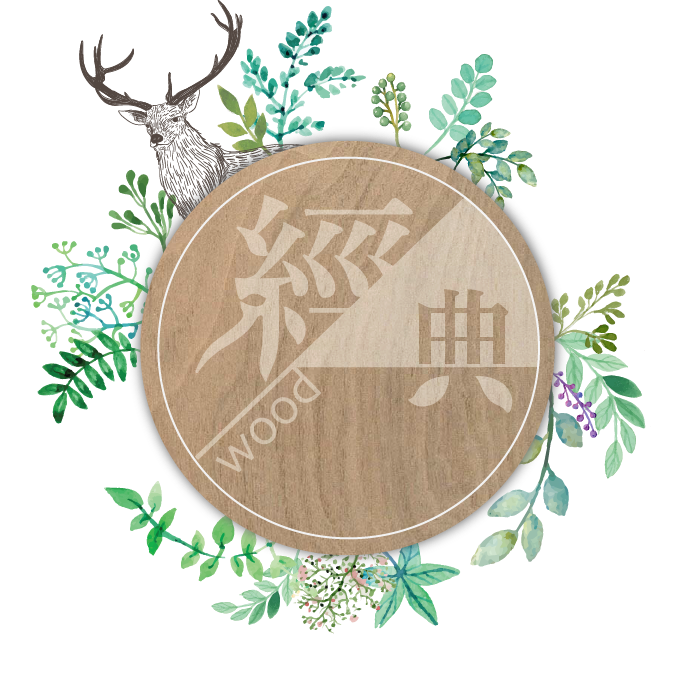
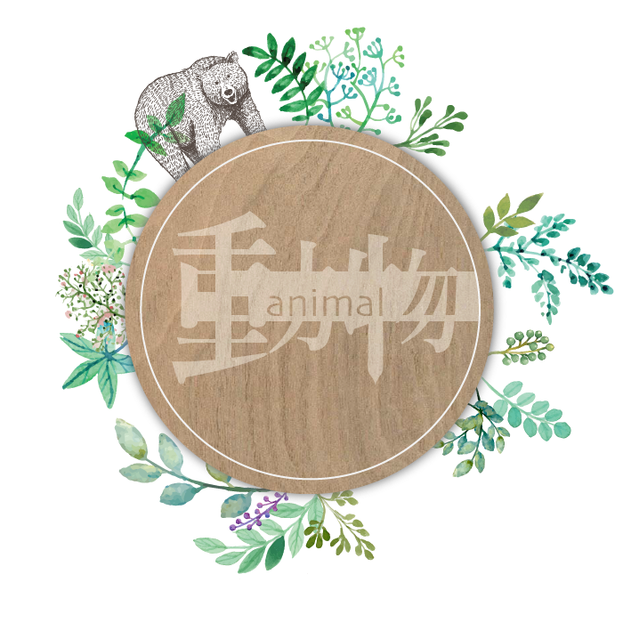
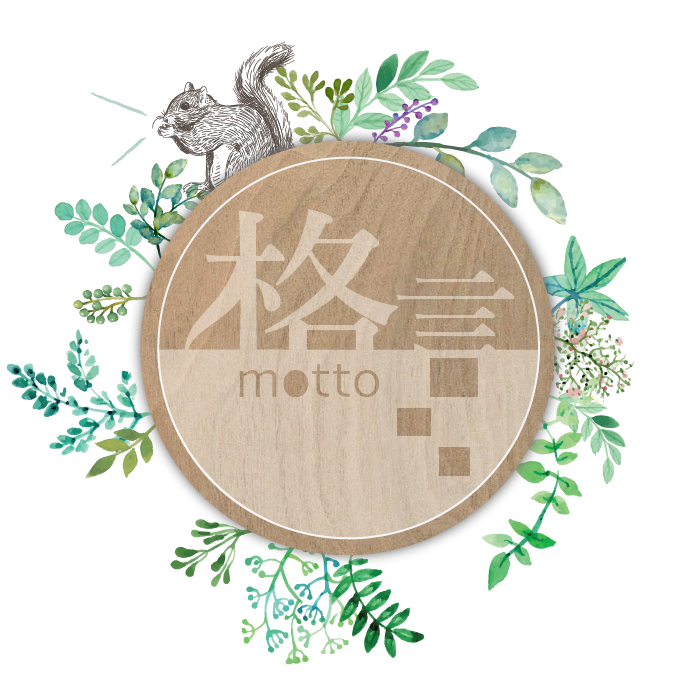

# UniSay | 由你說

### UniSay 木質手機殼
>UniSay採用Unique的前字，代表每個人獨特且無法取代的心情，UniSay諧音由你訴說自己的心情！
>縮寫US代表我們與你站在同一陣線，陪著你面對生活的快樂悲傷與滿足。

古代人刻字在座位右邊用來激勵自己在課業上的成就，隨著時間更迭，現代人最常接觸到的就是手機，而手機殼也變成一個足以代表自己的配件。有感於現代人面對生活的壓力時需要一句話的力量振奮自己，又或者已經滿足於當下的心靈狀態，因此想利用一句話的力量鼓勵自己或他人，我們選擇將這些話刻在手機殼上，讓人可以時時刻刻檢視自己，或給自己力量面對未來的種種未知生活。
我們所使用的木頭有著自然的紋理，淡淡的木頭香氣和專屬於木頭樸實的質感，將質感融入顧客的生活，並透過網路行銷推廣，提供線上購買商品，除了一般經典款、動物款、格言款的款式之外，我們也提供客製化的服務，讓顧客擁有與別人與眾不同的手機殼，進而提升品牌形象，促使顧客對於我們的產品有持續回購的意願並消費，創造專屬於自己的與眾不同。

|經典款|動物款|格言款|
|-------------|-------------|-------------|
||||

### 網站特色
>本網站以柔和且自然的方式呈現，整體感覺為簡約中帶獨特、優雅中帶質感的風格，極具想一再瀏覽的特色。

我們的網站跳脫一般的手機殼購物網站，除了將一句話的力量賦予在手機殼上使顧客看到手機殼上的一句話便能激勵自己以外，也將守護精靈的概念帶進手機殼中，延伸至提升心靈的力量，讓顧客不會覺得自己在生活上孤軍奮戰，進而更有勇氣面對生活上的困境。
並加上客製化刻字的服務，使顧客能夠擁有與他人與眾不同的手機殼，也可以自己選擇是否加入守護精靈的角色讓手機殼更有個人特色，更輔以與顧客互動的心理測驗小遊戲增加顧客在網站的停留時間。
以上的所有配置讓顧客增加對我們的網站記憶點，讓他們在那麼多網站中看過就算不買也會記得我們的網站，要選購時還是會回到我們的網站，這種具有行銷手法且別於一般手機殼網站的精緻度便可以吸引更多群族的目光。
